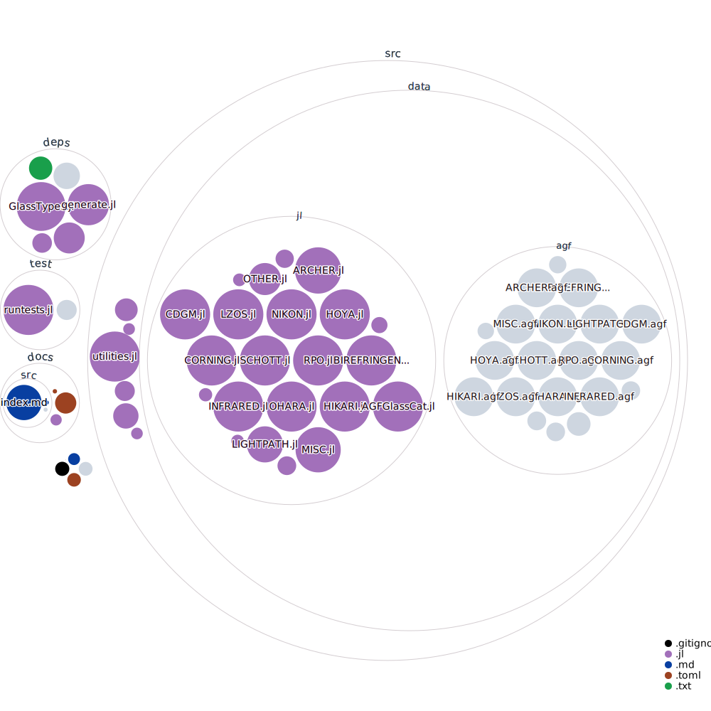

# AGFFileReader

 

This is a standalone version of AGFFileReader.jl, which previously was incorporated as part of OpticSim.jl under the name GlassCat.jl. It provides functions for reading AGF glass files used in optical design.

